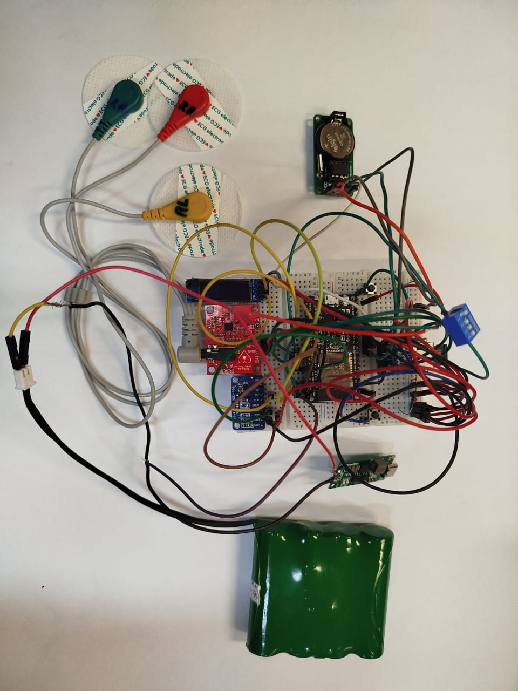

# IP III - ECG

**Título do projeto:** Aplicativo e Eletrônica Compacta para Eletrocardiograma

**Programadores:** André de Araújo Caetano & Anna Karen de Oliveira Pinto

**Objetivo**: O código foi desenvolvido durante o período da disciplina Iniciação a Pesquisa III. O principal objetivo é o desenvolvimento de um dispositivo baseado em Arduino capaz de coletar, armazenar e enviar dados sobre o eletrocardiograma (ECG). Além disso, desenvolver um aplicativo capaz de receber via Bluetooth esses dados e realizar a análise desses dados. Por isso, o presente repositório pode ser resumido em dois códigos principais:
- `CODIGO_ESP32.ino`: Este é o resultado final do código do dispositivo com todos os sensores e controlado por uma ESP32.
- `aplicativo.ipynb`: Este é o "aplicativo" que não teve a interface gráfica desenvolvida mas que contém o recebimento dos dados via Bluetooth e o processamento deles.

# CODIGO ESP32 - ELETRÔNICA

O código final utilizado no dispositivo ESP32 está contido no caminho `ELETRONICA/CODIGO_ESP32` caso você esteja utilizando o ambiente Arduino IDE. Apesar de esta ser a plataforma mais conhecida é extremamente recomendável se utilizar a plataforma `PlatformIO` disponível no Visual Code. Essa plataforma é bastante atualizada e compila códigos, especificamente para ESP32, muito mais rápido. Caso opte por utilizar a `PlatformIO`, nesse mesmo diretório existe a pasta `/IP - ECG` que é uma pasta reconhecida por essa plataforma como um projeto, o que otimiza o seu uso para outros usuários pois todas as configurações e bibliotecas estão contidas nessa pasta.

Apesar da eletrônica ser uma parte fundamental desse projeto o código final tem cerca de 308 linhas e seria extremamente extensivo discorrer durante o `README`. Por isso, o principal do código é se observar as variáveis em que serão conectados cada sensor, motivo esse ser um dos grandes motivos pelo atraso do projeto. 

Além disso, uma grande dificuldade foi encontrar tutoriais sobre a utilização conjunta dos sensores, visto que os membros do projeto não tinham tanto conhecimento a cerca dessa área. Visando melhorar a experiência para outros programadores que queiram utilizar a microeletrônica, mas que não desejam se tornar profissionais ou querem algo rápido, do diretório `SKETCHS` você poderá encontrar uma série de arquivos `.ino` que coordenam cada sensor individual com a ESP32 além de todas as versões do código final. A criação desse diretório se dá ao fato de outro motivo de atraso do projeto é a falha eletrônica recorrente que esses dispositivos, muitas vezes sensíveis, apresentam em suas conexões o que acaba "corrompendo" o código. Um grande exemplo é a utilização do módulo `Display OLED 128x32` que, quando suas conexões dão erro durante o uso do dispositivo, apresenta um erro sobre a conexão do tipo I2C que mesmo sendo consertada o dispositivo não volta a funcionar. Uma solução para isso é compilar o código individual do módulo com a ESP32 para reativar sua utilização e por fim compilar o seu código de interesse para retornar a normalidade. Erros semelhantes ocorrem com o módulo `microSD`, por conta disso optamos por criar essa pasta e facilitar a disponibilidade de códigos "base" para cada módulo.

Versão final do protótipo do dispositivo:

# CODIGO JUPYTERBOOK - APLICATIVO

Por conta do tempo gasto na programação do dispositivo o tempo investido no desenvolvimento do aplicativo, que em seu início seria um aplicativo de celular, foi bastante curto sendo possível apenas o desenvolvimento das suas funcionalidades via plataforma Jupyter Lab, em um jupyter notebook. Apesar de não possuir interface gráfica cumpre sua função proposta de:
- Estabelecer conexão Bluetooth com o dispositivo para descarga dos arquivos
- Realizar a análise dos dados de ECG

O aplicativo está intitulado de `aplicativo.ipynb` e esta dentro da pasta `/APLICATIVO`, essa pasta também consta o arquivo `requirements.txt` que contêm todas as biblitecas utilizadas e suas versões. É extremamente recomendável criar um ambiente conda próprio para utilizaçã desse código. A principal bibliteca do código é a [NeuroKit2](https://github.com/neuropsychology/NeuroKit) que irá receber os arquivos de ECG e realizar seu processamento de forma mais fácil. O código pode ser dividido na mesma divisão das funções estabelecidas anteriormente. Também disponibilizamos dados de teste que foram obtidos por nosso equipamento para aqueles que, muito possívelmente não terão a mesma eletrônica. 

Dado isso, o fluxograma de utilização do código por um usuário seria:

## 1. Inicializar o ambiente e as bibliotecas;

## 2. Criação das pastas do `paciente` que guardarão os arquivos e um arquivo concatenado de todos os outros para uma análise de longa duração;
No caso a pasta para os dados de teste contêm o nome do paciente `Paciente_teste`.

### 2.1 No caso de se possuir o dispositivo, ligar a conexão do dispositivo, parear com o computador e rodar a linha de código referente a essa ação;

Caso a conexão tenha se estabelecido de forma correta a seguinte mensagem poderá ser observada no output da celula:

Além disso, no dispositivo o simbolo de Bluetooth irá aparecer estático.

## 3. Análises disponíveis:

Após concluir a etapa de criação da pasta do paciente, a pasta `Concatenados`, a pasta `Dados` e a pasta `Gráficos` e ter carregado com os dados, para os que tem o dispositivo, podemos iniciar as análises.

### 3.1 Determinação da frequência cardíaca

Para utilizar os dados de teste atribua o valor `"Paciente_teste"` à variável `nome_do_paciente`, caso tenha criado seu paciente utilize o mesmo nome da pasta criada na etapa `2`. Após isso, rode a celula. O output para os dados de teste deverão ser:

### 3.2 Perfil da Frequência Cardíaca

Com a frequência cardiaca definida podemos partir para o `Perfil médio do padrão ECG` que determina como os dados estão se comportando. Caso seus dados tenham sido bons ou esteja utilizando os dados de teste o gráfico será algo semelhante ao seguinte:

Após isso, o código irá salvar esse código na pasta `/Gráficos` do paciente estabelecido da etapa `3.1`.

### 3.3 Identificação dos picos (PQST)

Além do pico R o ECG conta com outros picos que trazem outras informações dependendo da forma como o dado foi coletado. Para isso recomenda-se a seguinte [leitura](https://pt.my-ekg.com/generalidades-ecg/intervalos-segmentos-ecg.html). A função **NeuroKit2** também já conta com essa funcionalidade, para isso o output será algo semelhante a:

### 3.4 Segmentação temporal dos dados

Esse tipo de análise é útil para se analisar todo o período de coleta dos dados. O código dessa celula contém a variável `segment_duration` que determina o `range` de corte dos dados carregados. Essa variável é importante pois, o dado de teste utilizado é de 1 minuto de leitura, mas a leitura pode ser de horas ou até dias, logo a mudança dessa variável vai depender do contexto de cada aplicação.

### 3.5 Identificação dos picos R

Essa função já foi utilizada na etapa `3.1` mas nessa parte do código podemos plotar todo o dado coletado (60 segundos) e identificar se os picos R estão seguindo um padrão tanto de distância quanto de intensidade.

### 3.6 Detecção de anomalias

A **detecção de anomalias nos intervalos RR** é realizada para identificar possíveis arritmias cardíacas. Arritmias são alterações nos intervalos entre batimentos cardíacos. No entanto, **É FORTEMENTE RECOMENDÁVEL NÃO SE UTILIZAR DESSA FUNÇÃO COMO COMPROVAÇÃO MÉDICA DE POSSÍVEIS DOENÇAS** essa função é apenas para efeito de finalização do pacote de futuras funções do aplicativo. Além disso, podemos obter a porcentagem de anomalias do total de picos R e comparar com os gráficos gerados nas funções anteriores para identificar se essas anomalias são erros na obtenção dos dados.

# Termo de Uso de IA Generativa

Durante todo período do projeto se fez uso da IA conhecida como [CHATGPT](https://chatgpt.com) para aperfeicoamento e correções de erros do código.

# Agradecimentos

Agradecemos ao Centro Nacional de Pesquisa em Energia e Materiais e a Ilum Escola de Ciência pelo financeamento e tempo fornecido para o desenvolvimento desse projeto. Além disso, a todos os professores da Ilum por acreditarem em seus alunos e sempre inspira-los a irem mais longe a cada dia.

"Eu trabalho com o que eu gosto, pude voltar a ser um herói. Eu estou vivendo o meu sonho, não tem nada melhor do que isso" - Izuku Midoriya da obra My Hero Academia de Kohei Horikoshi

